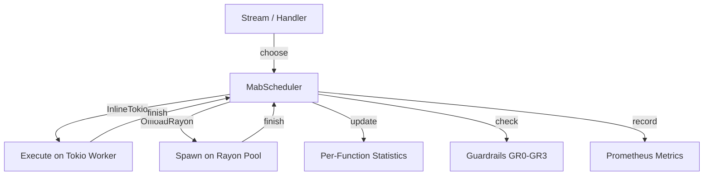
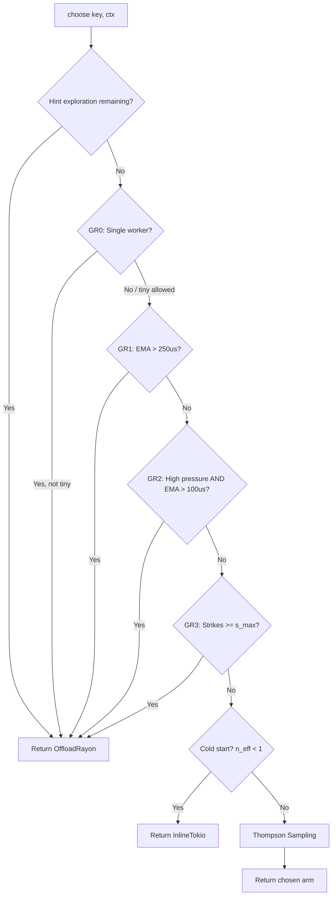

# DEP-0000: Adaptive Compute Scheduling via Multi-Armed Bandit

- **Status:** Draft
- **Authors:** Ryan
- **Category:** Architecture
- **Created:** 2026-02-04

## Summary

A Multi-Armed Bandit (MAB) scheduler that learns per-function whether to execute compute work inline on Tokio or offload to Rayon, protecting async runtimes from starvation while optimizing throughput. The scheduler uses Thompson Sampling with Bayesian posterior updates and four guardrails to make adaptive, per-function decisions with less than 200ns overhead.

## Motivation

### The Inline-vs-Offload Tradeoff

When processing compute work in an async application, every dispatch point faces a binary decision:

| Strategy | Pros | Cons |
|----------|------|------|
| **Always Inline** | Zero overhead (~0ns per task) | Blocks Tokio worker threads, increases async task wake latency, risks starvation |
| **Always Offload** | Never blocks Tokio | Fixed overhead (~100-500ns per task), cross-thread synchronization cost |

The optimal strategy depends on three variables that change at runtime:
- **Function execution time**: Fast work (<50us) is cheaper inline; slow work (>250us) must be offloaded
- **System pressure**: Under high load, even moderate work should offload
- **Per-function characteristics**: Each function has different timing profiles

### The Cost of Getting It Wrong

We built an evaluation harness to measure the cost of each static strategy. The findings motivate the need for an adaptive approach:

**Throughput penalty of always-offload:** For fast work (~10us), `adaptive_map()` achieves +1523% higher throughput than `compute_map()` (1,392,286/s vs 85,761/s). The offload overhead dominates when function execution time is small — always-offloading leaves over 15x performance on the table.

**Starvation risk of always-inline:** When 3ms compute work is inlined on a single-tokio-thread runtime at 1500 tasks/sec, the P95 wake latency probe shows 1.5x interference (2924us vs 1981us baseline). The tokio event loop cannot process timers, I/O completions, or other async tasks while blocked by compute work. The adaptive scheduler keeps interference at 0.8x — better than baseline — by learning to offload heavy work.

**Mixed workloads need adaptation:** Real workloads contain a mix of fast and slow functions. A static always-offload policy achieves only 58,673 items/s on mixed workloads, while the adaptive scheduler achieves 249,178 items/s (+325%). The MAB learns per-function strategies, achieving the best of both worlds.

### Impact of Inaction

Without adaptive scheduling, teams must choose between:
1. **Paying the throughput tax**: Using `spawn_compute()` everywhere adds 100-500ns per call, even for 5us work where the overhead exceeds the function time
2. **Risking starvation**: Inlining everything works until a slow function blocks the event loop
3. **Manual annotation**: Requiring developers to categorize every function as "fast" or "slow" is error-prone, doesn't adapt to changing hardware, and breaks when function timing depends on input

### Why Thompson Sampling

Thompson Sampling was chosen over other exploration-exploitation algorithms because:
- **Bayesian**: Maintains a posterior distribution over costs, naturally expressing uncertainty
- **Non-stationary**: Combined with exponential decay (half-life ~2000 observations), adapts to changing workload characteristics
- **Low overhead**: Sampling from a Normal posterior requires only a few floating-point operations (~50ns warm)
- **Proven**: Extensive theoretical and practical results (Thompson 1933, Chapelle & Li 2011, Russo et al. 2018)

## Goals

- **REQ-PERF-1**: Decision overhead SHOULD be < 200ns for warm decisions (existing function key with statistics)
- **REQ-PERF-2**: Wake latency interference under adaptive scheduling SHOULD be < 2x baseline
- **REQ-PERF-3**: Throughput SHOULD be at parity or better than always-offload on mixed workloads
- **REQ-LEARN-1**: Scheduler SHOULD converge to correct strategy within 50 observations
- **REQ-SAFE-1**: Zero starvation events under guardrail protection for known-slow functions

## Non-Goals

- **Cross-restart persistence**: Learned state is not persisted across process restarts. Cold-start hints and fast convergence make this acceptable.
- **Cross-runtime sharing**: Statistics are not shared between LoomRuntime instances. Each runtime learns independently.
- **Heterogeneous hardware awareness**: The scheduler does not account for different core speeds (e.g., P-cores vs E-cores). It learns observed costs which implicitly include hardware characteristics.
- **Replacing manual `spawn_compute()`**: For functions known at development time to be consistently slow (>250us), `spawn_compute()` remains the correct choice. The MAB is for unknown or variable workloads.

## Requirements

The key words "MUST", "MUST NOT", "SHOULD", "SHOULD NOT", and "MAY" in this section are to be interpreted as described in RFC 2119.

- **REQ-1 (GR1)**: The scheduler MUST NOT inline when the exponential moving average (EMA) of function execution time exceeds `t_block_hard_us` (default: 250us). This is a hard safety ceiling.
- **REQ-2 (GR3)**: The scheduler MUST suppress inline execution after repeated slow inline executions (strikes >= `s_max`). Strikes accumulate when inline execution exceeds `t_strike_us` (default: 1ms) and decay with half-life ~100 observations.
- **REQ-3 (GR2)**: The scheduler MUST restrict inline execution under high pressure (pressure > `p_high`, default: 3.0) when EMA exceeds `t_inline_under_pressure_us` (default: 100us).
- **REQ-4 (GR0)**: Single-worker runtimes (`tokio_workers == 1`) MUST use a conservative inline policy: only allow inline when EMA < `t_tiny_inline_us` (default: 50us) AND pressure < `p_low` (default: 0.5).
- **REQ-5**: The scheduler SHOULD converge to the correct strategy (inline for fast work, offload for slow work) within 50 observations for clearly-differentiated workloads.
- **REQ-6**: Decision overhead SHOULD be < 200ns for warm decisions (function key with existing statistics).

## Proposal

### Architecture

The MabScheduler sits between the dispatch point (stream combinator or handler code) and the execution pools (Tokio and Rayon):



### Decision Flow

Each call to `choose()` follows this path:



### Thompson Sampling Algorithm

The scheduler maintains per-function, per-arm statistics using a log-cost model:

1. **Observation**: Transform observed cost as `log_cost = ln(observed_cost_us)`
2. **Posterior update** (Welford's online algorithm with decay):
   ```
   n_eff *= decay          // Exponential decay (half-life ~2000)
   n_eff += 1
   delta = log_cost - mu
   mu += delta / n_eff
   delta2 = log_cost - mu
   s2 += delta * delta2
   ```
3. **Sampling**: Draw from `Normal(mu, variance / n_eff)` for each arm
4. **Adjusted cost comparison**:
   ```
   inline_adjusted = inline_sample * (1 + k_starve * pressure)
   offload_adjusted = offload_sample + ln(offload_overhead_us)
   ```
5. **Decision**: Choose the arm with lower adjusted cost

### Pressure Index

Pressure quantifies how stressed the Tokio runtime is:

```
pressure = w_inflight * (inflight_tasks / tokio_workers)
         + w_spawn * (spawn_rate / (1000 * tokio_workers))
```

Clipped to `pressure_clip` (default: 10.0).

| Pressure Level | Interpretation |
|----------------|----------------|
| < 0.5 | Low - inline is safe |
| 0.5 - 3.0 | Normal - MAB decides |
| > 3.0 | High - GR2 restricts inline |

### Guardrail Specification

| Guardrail | Condition | Effect | Rationale |
|-----------|-----------|--------|-----------|
| GR0 | `tokio_workers == 1` | Only inline if EMA < 50us AND pressure < 0.5 | Single worker: any block is total starvation |
| GR1 | `ema > 250us` | Never inline | Hard ceiling: 250us blocks are always too long |
| GR2 | `pressure > 3.0 AND ema > 100us` | Never inline | Under pressure: tighter threshold |
| GR3 | `strikes >= 1.0` | Never inline | Repeated slow inlines: suppress until strikes decay |

### Usage Patterns

#### Stream Mode: `adaptive_map()`

Each stream instance creates its own `MabScheduler` for immediate per-item feedback:

```rust
use loom_rs::ComputeStreamExt;

let results: Vec<_> = stream::iter(items)
    .adaptive_map(|item| process(item))
    .collect()
    .await;
```

The per-stream scheduler learns from each item immediately. Statistics are discarded when the stream is dropped.

#### Handler Mode: `mab_scheduler()`

For request handlers where the decision and outcome are separated in time:

```rust
let sched = runtime.mab_scheduler();
let key = FunctionKey::from_type::<MyHandler>();

async fn handle(runtime: &LoomRuntime, req: Request) -> Response {
    let ctx = runtime.collect_context();
    let (id, arm) = sched.choose(key, &ctx);
    let start = Instant::now();
    let result = match arm {
        Arm::InlineTokio => process(req),
        Arm::OffloadRayon => runtime.spawn_compute(|| process(req)).await,
    };
    sched.finish(id, start.elapsed().as_micros() as f64, None);
    result
}
```

The shared scheduler persists for the runtime lifetime and accumulates statistics across all handler invocations.

### Compute Hints

For cold-start guidance, input types can implement `ComputeHintProvider`:

| Hint | Initial EMA | Cold-Start Behavior |
|------|------------|---------------------|
| `Unknown` | 0 | Default exploration (try inline first) |
| `Low` | 30us | Seeds EMA low, likely inline |
| `Medium` | 200us | Seeds EMA medium, explores both |
| `High` | 1000us | Seeds EMA high, forces 3 initial offloads |

Hints only affect cold start. Once `n_eff > hint_trust_threshold` (default: 5), the scheduler relies entirely on observed data.

### Configuration Knobs

| Parameter | Default | Description |
|-----------|---------|-------------|
| `k_starve` | 0.15 | Starvation cost multiplier |
| `w_inflight` | 0.7 | Inflight task weight in pressure |
| `w_spawn` | 0.3 | Spawn rate weight in pressure |
| `pressure_clip` | 10.0 | Maximum pressure value |
| `decay` | 0.999653 | Per-observation decay (half-life ~2000) |
| `strike_decay` | 0.993 | Strike decay (half-life ~100) |
| `ema_alpha` | 0.1 | EMA smoothing factor |
| `t_tiny_inline_us` | 50.0 | GR0: safe inline threshold |
| `t_block_hard_us` | 250.0 | GR1: hard block threshold |
| `t_inline_under_pressure_us` | 100.0 | GR2: under-pressure threshold |
| `p_low` | 0.5 | Low pressure boundary |
| `p_high` | 3.0 | High pressure boundary (GR2) |
| `t_strike_us` | 1000.0 | Strike threshold (1ms) |
| `s_max` | 1.0 | Max strikes before suppression |

## Validation

The evaluation suite (`examples/mab_evaluation.rs`) measures each claim through a progression of tests. Run with: `cargo run --example mab_evaluation --release > evaluation_report.md`

### Overhead Measurements

| Operation | Target | Measured |
|-----------|--------|----------|
| `choose()` cold | - | 211ns mean (P50: 104ns, P99: 254ns) |
| `choose()` warm | < 200ns | 113ns mean (P50: 109ns, P99: 148ns) |
| Full cycle (choose + finish) | - | 182ns mean (P50: 172ns, P99: 210ns) |

**Verdict:** Decision overhead of 113ns warm is well within the 200ns budget.

### Wake Latency Comparison

Tested on a dedicated 1-tokio-thread runtime with 3ms work at 1500 tasks/s. Baseline (no load): P50=981us, P95=1981us.

| Strategy | P50 | P95 | P99 | Interference | Throughput |
|----------|-----|-----|-----|--------------|------------|
| AlwaysInline | 2920us | 2924us | 2934us | 1.5x | 331/s |
| AlwaysOffload | 962us | 1683us | 1869us | 0.8x | 697/s |
| Adaptive (MAB) | 963us | 1681us | 1868us | 0.8x | 686/s |

**Verdict:** AlwaysInline degrades P95 latency by 1.5x. Both AlwaysOffload and Adaptive maintain 0.8x interference. The MAB achieves offload-level protection while retaining the ability to inline fast work.

### Throughput Comparison

| Workload | compute_map | adaptive_map | Speedup |
|----------|-------------|--------------|---------|
| Fast (~10us) | 85,761/s | 1,392,286/s | +1523% |
| Medium (~100us) | 55,222/s | 209,818/s | +280% |
| Slow (~500us) | 27,802/s | 44,509/s | +60% |
| Mixed (60/30/10) | 58,673/s | 249,178/s | +325% |

**Verdict:** Adaptive scheduling dramatically outperforms always-offload, especially for fast work where offload overhead dominates.

### Learning Convergence

| Work Type | Observations to Stable | Final Decision | Correct? |
|-----------|------------------------|----------------|----------|
| Fast (~20us) | 5 | Inline | Yes |
| Slow (~500us) | 6 | Offload | Yes |

After training, fast work shows 100% inline, slow work shows 100% offload. GR1 and GR3 both activate during slow-work training.

### Workload Shift Adaptation

200 fast observations (20us) followed by 200 slow observations (500us):

| Observation Range | Inline % | Offload % |
|-------------------|----------|-----------|
| Fast 1-200 | 100% | 0% |
| Slow 1-50 | 14% | 86% |
| Slow 51-200 | 0% | 100% |

**Observations to switch after shift:** 10. The MAB detects the regime change and converges to full offload within the first 50 slow observations.

### Pressure Escalation

4-tokio-thread runtime with 150us work (above GR2 threshold of 100us, below GR1 threshold of 250us):

| Load Level | Spawn Rate | Pressure | GR Activations | Inline % |
|------------|------------|----------|----------------|----------|
| Low | 100/s | 0.7 | 0 | 99% |
| Medium | 1000/s | 2.2 | 0 | 100% |
| High | 4000/s | 3.8 | 99 | 1% |
| Very High | 8000/s | 7.6 | 99 | 1% |
| Extreme | 20000/s | 10.0 | 99 | 1% |

**Key finding:** 297 guardrail activations at pressure > 3.0 (the `p_high` threshold). Below `p_high`, the MAB freely inlines. Above `p_high`, GR2 forces offload for work exceeding 100us.

### Thread Configuration Analysis

Different tokio:rayon ratios were tested to verify the MAB performs well across configurations:

| Config | Tokio:Rayon | compute_map | adaptive_map | Speedup |
|--------|-------------|-------------|--------------|---------|
| minimal-tokio | 1:15 | 59,333/s | 242,489/s | +309% |
| balanced-tokio | 2:14 | 54,140/s | 241,836/s | +347% |
| equal-split | 8:8 | 63,619/s | 242,915/s | +282% |

All configurations show zero starvation events and sub-1x wake latency interference under adaptive scheduling. The MAB's benefits are consistent across thread ratios.

### Observability

The scheduler exposes Prometheus counters for runtime monitoring:

| Metric | Description |
|--------|-------------|
| `{prefix}_inline_decisions` | Total inline decisions |
| `{prefix}_offload_decisions` | Total offload decisions |
| `{prefix}_gr1_activations` | GR1 hard threshold activations |
| `{prefix}_gr2_activations` | GR2 pressure threshold activations |
| `{prefix}_gr3_activations` | GR3 strike suppression activations |
| `{prefix}_starvation_events` | Starvation events (slow inline execution) |
| `{prefix}_pressure_index` | Current pressure index |

## Alternate Solutions

### Alt 1: Static Threshold

**Approach**: Use a fixed execution time threshold (e.g., 100us) to decide inline vs offload.

**Pros**: Simple to implement, zero learning overhead, deterministic.

**Cons**: No per-function learning (one threshold for all functions), no pressure awareness (same threshold under high and low load), requires manual tuning per deployment.

**Rejected**: Doesn't adapt to different function profiles, changing hardware, or varying system load. A threshold tuned for one workload is wrong for another.

### Alt 2: UCB1 (Upper Confidence Bound)

**Approach**: Use UCB1 instead of Thompson Sampling for arm selection.

**Pros**: Deterministic (no sampling), well-studied theoretical guarantees, simpler implementation.

**Cons**: Less adaptive to non-stationary environments (UCB1 assumes stationary rewards), no natural posterior distribution for cost modeling, confidence bounds grow slowly.

**Rejected**: Thompson Sampling handles changing workloads better due to decay-weighted posteriors. The stochastic nature of Thompson Sampling also provides more natural exploration in the face of uncertainty.

### Alt 3: Manual Annotation Only

**Approach**: Require developers to annotate each function as "fast" (inline) or "slow" (offload) using `spawn_compute()` or direct execution.

**Pros**: Zero runtime overhead, explicit control, no surprises.

**Cons**: Requires developer knowledge of execution times, wrong for variable workloads (same function can be fast or slow depending on input), doesn't adapt to hardware changes, maintenance burden.

**Rejected**: Compute hints provide cold-start guidance without replacing learning. Manual annotation is still appropriate for known-slow functions (`spawn_compute()`), but the MAB handles the variable and unknown cases.

### Alt 4: Work-Stealing Between Pools

**Approach**: Instead of separate Tokio and Rayon pools, use a unified work-stealing scheduler that can move tasks between async and compute contexts.

**Pros**: Automatic load balancing, no explicit decision needed, can handle bursty workloads.

**Cons**: Fundamentally different architecture from Tokio + Rayon, complex implementation, doesn't solve per-function optimization (work-stealing is about load balancing, not about whether to block the event loop), would require forking or replacing Tokio's scheduler.

**Rejected**: Wrong abstraction level. The problem isn't load balancing between pools; it's deciding whether a specific function should run on the event loop or be moved off it. Work-stealing doesn't prevent starvation when a stolen task blocks the stealer.

## Background / References

- Thompson, W.R. (1933). "On the Likelihood that One Unknown Probability Exceeds Another in View of the Evidence of Two Samples." *Biometrika*, 25(3/4), 285-294.
- Chapelle, O. & Li, L. (2011). "An Empirical Evaluation of Thompson Sampling." *Advances in Neural Information Processing Systems*, 24.
- Russo, D.J., Van Roy, B., Kazerouni, A., Osband, I., & Wen, Z. (2018). "A Tutorial on Thompson Sampling." *Foundations and Trends in Machine Learning*, 11(1), 1-96.
- Welford, B.P. (1962). "Note on a Method for Calculating Corrected Sums of Squares and Products." *Technometrics*, 4(3), 419-420.
- Tokio documentation on blocking and `spawn_blocking`: Discussion of starvation risks when compute work runs on async worker threads.
